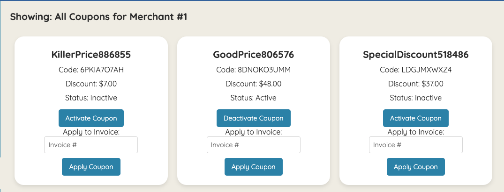

# Little Shop

[Little Shop FE Repo](https://github.com/jimmacur/little-shop-fe-final-starter)

[Jim Macur LinkedIn](https://www.linkedin.com/in/jimmacur/)

### Abstract:
The Little Shop FE is a user interface that allows merchants to manage their coupons. Features include viewing a list of all coupons, activating and deactivating coupons, and applying coupons to specific invoices. The app solves the problem of manually tracking and managing discount codes, making it easier for merchants to handle promotions. By providing interactive buttons and inputs for activation and invoice assignment, the application streamlines the coupon management process, improving efficiency for merchants.

### Installation Instructions:

1. Fork this backend repo 
[Little Shop BE Repo](https://github.com/jimmacur/little-shop-be-final-starter)
1. Run these commands in your terminal
  - `bundle install`
  -  `rails db:{drop,create}`
  -  `rails runner ActiveRecord::Tasks::DatabaseTasks.load_seed`
  -  `rails db:migrate`
  -  `rails db:schema:dump`
  -  `rails s`

3. Fork this repo

[Little Shop FE Repo](https://github.com/jimmacur/little-shop-fe-final-starter)

4. Clone forked repo and rename it `git clone <repo> <new name>`
5. `cd` into cloned repo
6. Run `npm install`
7. Run `npm run dev`
  - You'll see in the terminal that the project has opened at "http://localhost:5173/"

### Preview of App:

### Context:
This was a solo project that included FE and BE development. Both the BE and FE had repos I was building off of. In both cases my ork was around adding functionality, display, and logic for coupons as well as invoices.

### Learning Goals:
- Write migrations to create tables and relationships between tables
- Implement CRUD functionality for a resource
- Use MVC to organize code effectively, limiting the amount of logic included in serializers and controllers
- Use built-in ActiveRecord methods to join tables of data, make calculations, and group data based on one or more attributes
- Write model tests that fully cover the data logic of the application
- Write request tests that fully cover the functionality of the application
- Display data for users in a frontend application by targeting DOM elements

### Wins + Challenges:
- I am very pleased with getting the styling to match the original and also improving the flex box on the entire application to make it more user friendly. 
- I also think that the selection of elements to be displayed really considers what the user will need and displays it in a way that is easy to understand.
- If given more time I would have given more functionality to the buttons, added an area to display invoices, and made a more dynamic relationship between those and the merchant
- In hindsight, I also wish I spent more time exploring the existing code as I tried to recreate the wheel only to din later that there was a lot of functionality already built in that I could use. There were also similar functions that could be mimicked in order to streamline the process of writing the new functions.